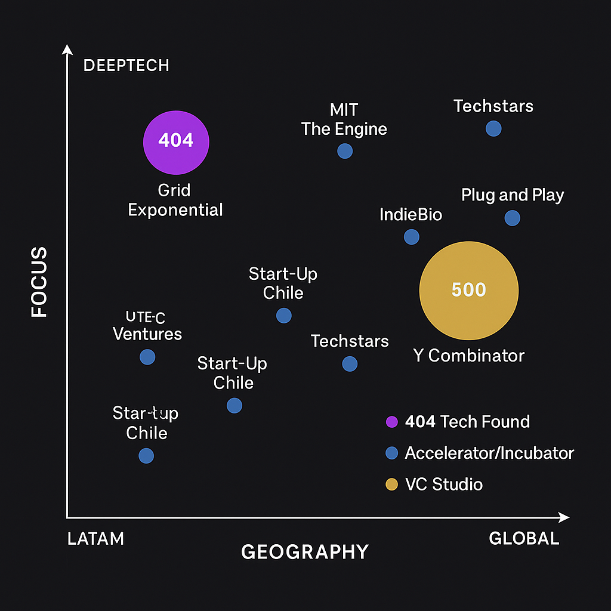
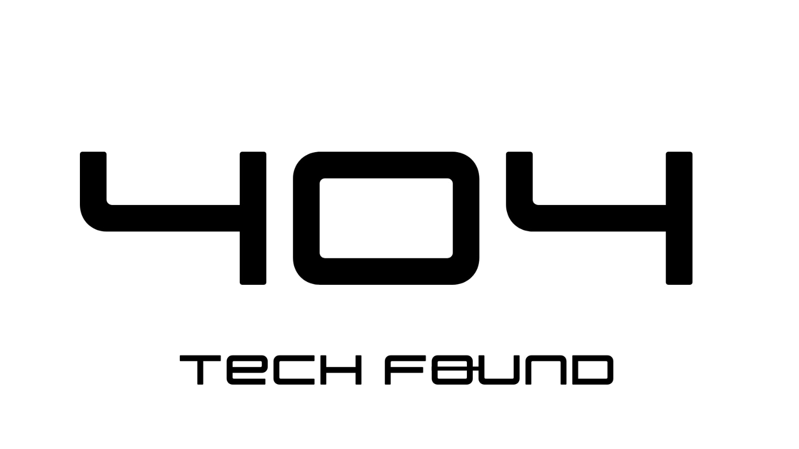
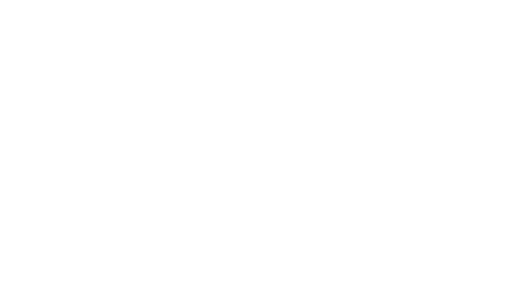
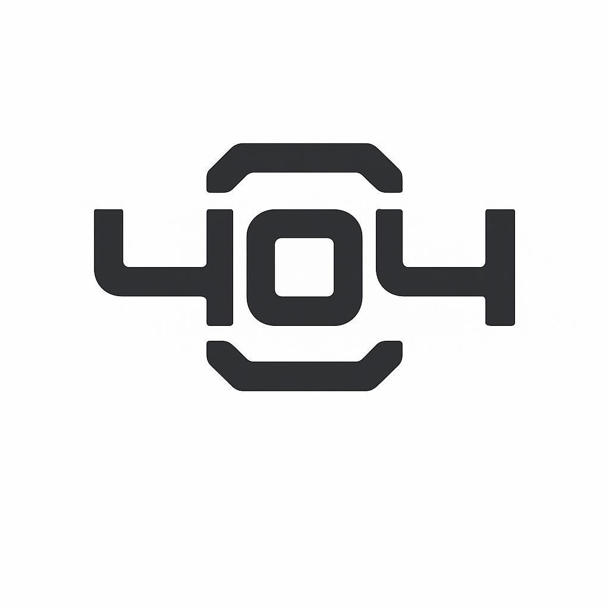

# 404 Tech Found · Brand Book v1.0

---

## 1 · Brand Essence

| Element              | Definition                                                                                                                                   |
| -------------------- | -------------------------------------------------------------------------------------------------------------------------------------------- |
| **Purpose (10 yr)**  | *Catalyse a LATAM deep-tech renaissance by turning breakthrough science into venture-grade companies, right where the talent is.*            |
| **Mission (1–3 yr)** | *Become Perú’s #1 deep-tech pre-incubator—graduating multiple “404 Founders” and launching our venture-builder/accelerator arm.*                   |
| **Primary tagline**  | **“Building the 404 deep-tech startups of LATAM.”**                                                                                          |
| **Positioning**      | *Built by deep-tech founders, for deep-tech founders.*                                                                                       |
| **Archetype**        | **Maverick × Explorer** — rebellious, pioneering, boundary-pushing.                                                                          |
| **Core values**      | 1. **Science-first rigor**  2. **Radical openness**  3. **Purposeful failure**  4. **Community before ego**  5. **Momentum over perfection** |

### 1.1 Narrative timeline

| Year/Q      | Milestone                                            |
| ----------- | ---------------------------------------------------- |
| **2025 Q2** | Deeptech Meetup #01 → proof of community demand      |
| **2025 Q3** | Pre-incubator Cohort α (18 teams)                    |
| **2025 Q4** | Start our consultory, we know how to create deeptech                    |
| **2026 Q2** | Launch full **Incubator** track + micro-fund         |
| **2027 Q1** | **Venture-Builder** studio → 3 in-house spin-outs    |
| **2030 Q4** | 100 LATAM deep-tech companies backed, 5 global exits |

---

## 2 · Audience Matrix & Personas

| Segment                    | Proto-persona                               | Need / Pain                          | Perception Goal          | Key Touch-points                  |
| -------------------------- | ------------------------------------------- | ------------------------------------ | ------------------------ | --------------------------------- |
| **Investors** (VC/CVC)     | *María V.* – Deep-tech partner, US fund     | Credible pipeline, de-risked science | Trust · Tech-edge        | Deal rooms, demo days, data rooms |
| **Corporate partners**     | *Carlos R.* – Chief Innovation, mining corp | POCs, cutting-edge IP                | Reliability · Win-win    | Partner deck, PoC roadmap         |
| **Government & agencies**  | *Ana S.* – Innovation director, Produce     | Talent retention, GDP impact         | National pride · Clarity | Policy briefs, public reports     |
| **Founders / Researchers** | *Lucía P.* – PhD biotech student            | Funding, biz know-how, community     | Belonging · Empowerment  | Programme site, Discord           |
| **Media / Public**         | *Diego M.* – Tech journalist                | Breakthrough stories                 | Excitement · Credibility | Press kit, social, AMAs           |

### 2.1 Competitive landscape



---

## 3 · Personality & Voice

### 3.1 Voice sliders

* Formal   ◁────────●──▷ Casual
* Playful  ◁────●──────▷ Serious
* Academic ◁────────●──▷ Accessible

### 3.2 Tone-of-voice Do/Don’t

| Do                                              | Don’t                                  |
| ----------------------------------------------- | -------------------------------------- |
| “Let’s rewrite the laws of what’s possible.”    | “Disruptive paradigm shift synergies!” |
| Spanish: use **tú** / informal *vosotros* tone. | Overly corporate “Estimado señor”.     |
| Use emoji sparingly (max 1 per post).           | Emoji chains 🎉🚀🔥🔥🔥                |
| Cite sources for scientific claims.             | Hand-wave tech details.                |
| Plain-English explainers (“in 2 lines”).        | Dense academic abstracts.              |

### 3.3 Boiler-plates

```text
EN (50 w): 404 Tech Found is LATAM’s maverick deep-tech pre-incubator, built by founders for founders. We turn breakthrough science into venture-grade companies.

ES (50 w): 404 Tech Found es la pre-incubadora deep-tech de LATAM, creada por fundadores para fundadores. Convertimos ciencia de frontera en empresas escalables.
```

---

## 4 · Visual Identity System

### 4.1 Logo

| Variant                  | Preview                                 | Use case                  |
| ------------------------ | --------------------------------------- | ------------------------- |
| **Horizontal lock-up**   |  | Website nav, deck footers |
| **Inverse (near-white)** |           | Dark bgs / gradients      |
| **Isotype-only**            |                    | Favicon, social avatar    |


#### Mis-use examples

| ❌                         | Why                  |
| ------------------------- | -------------------- |
| Stretch / squash          | Distorts proportions |
| Drop shadows              | Reduces contrast     |
| Colours outside palette   | Breaks consistency   |
| Low-contrast on gradients | Fails WCAG           |

### 4.2 Colour palette

```rson
# BRAND NEUTRALS
near-black:  #111111  #CMYK 70/65/60/80  #Pantone Black 6 C
near-white:  #FAFAFA  #CMYK  0/ 0/ 0/ 2  #Pantone Cool Gray 1 C

# CORE
purple:      #5E17EB  #CMYK 71/78/ 0/ 0  #Pantone 2592 C
purple-alt:  #8C52FF  #CMYK 55/63/ 0/ 0  #Pantone 265 C

# HOUSES
biotech:     #00BF63  #CMYK 80/ 0/75/ 0  #Pantone 354 C
hardware:    #FFB400  #CMYK  0/35/100/ 0 #Pantone 1375 C
ai:          #FF66C4  #CMYK  0/60/ 0/ 0  #Pantone 212 C
space:       #38B6FF

Destructive: #f24545
```

*All fg/bg combos must ≥ 7 : 1 contrast.*

**Gradients**

```css
/* Core hero */
background: linear-gradient(135deg, #5E17EB 0%, #8C52FF 100%);

/* Biotech callout */
background: radial-gradient(circle at 30% 30%, #00BF63, #111111);
```

### 4.3 Typography

| Level   | Typeface           | Weight / Size / Tracking |
| ------- | ------------------ | ------------------------ |
| Logo    | **Orion**          | custom glyphs            |
| H1      | **Orbitron**       | 700 · 48 px · 0          |
| H2      | Orbitron           | 600 · 32 px · 0.5        |
| Body    | **Inter**          | 400 · 16 px · 0.2        |
| Caption | Inter              | 400 · 14 px · 0.3        |
| Code    | **JetBrains Mono** | 400 · 14 px              |

*Fallback stack*: `Inter, -apple-system, BlinkMacSystemFont, "Segoe UI", Roboto, Helvetica, sans-serif`.
*Line-height*: 1.35; baseline grid 4 px.

### 4.5 Mascot – **“Tardi”**

| Item          | Detail                                                                              |
| ------------- | ----------------------------------------------------------------------------------- |
| Master        | `tardi_master.png`                                           |
| Allowed edits | Minor expression, accessories; **no** hue-shift or horizontal flip (cyber-eye left) |
| Usage         | Community & swag. Formal docs → only in team slide footer @ 16 % opacity.         |

### 4.6 Programme Houses

| House    | Colour    | Tagline                               | Icon (SVG)         |
| -------- | --------- | ------------------------------------- | ------------------ |
| Biotech  | `#00BF63` | “Evolving life, engineering futures.” | `logo_biotech.svg`     |
| Hardware | `#FFB400` | “Atoms to products.”                  | `logo_hardware.svg` |
| AI       | `#FF66C4` | “Code that thinks.”                   | `logo_ai.svg`  |

House banners: core logo top-left + 4 px colour bar full-width.

### 4.7 Accessibility — WCAG AAA

| Element       | Rule                                             |
| ------------- | ------------------------------------------------ |
| Contrast      | ≥ 7 : 1 for text, ≥ 4.5 : 1 for non-text UI      |
| Min font size | Web 16 px, Print 12 pt                           |
| Focus style   | 3 px purple `#5E17EB` outline, offset 2 px       |
| Motion        | Provide `prefers-reduced-motion` alt: static SVG |
| Alt-text      | Mandatory (EN & ES) for every published asset    |

---
## 8 · Measurement, traction & KPIs

### 404 Deeptech Meetup

- 300 registrations
- +200 attendants

### Deeptech Summit

- Starting late september

### Deeptech pre-incubator

- 92 registrations
- Starting late june

---
### 8 · Benchmark & Case-Study Gallery — **extended**

| Name                                           | What it is                                                                   | Why it matters to 404                                                              | Key tactics / angles to dissect                                                                                                                           |
| ---------------------------------------------- | ---------------------------------------------------------------------------- | ---------------------------------------------------------------------------------- | --------------------------------------------------------------------------------------------------------------------------------------------------------- |
| **GRIDX (Grid Exponential)**<br>🇦🇷 Argentina | LATAM biotech **company-builder** & VC (80 + startups, 7 countries).         | Closest regional proxy for our future *venture-builder studio* model.              | • Annual science-talent funnel & “BioHack” bootcamps.<br>• Small cheques + lab access.<br>• Corporate-VC syndication playbook.                            |
| **BITKRAFT Ventures**<br>🇩🇪 / 🇺🇸 Global    | \$1 B + AUM sector fund in gaming / XR / “Synthetic Reality.”                | Gold-standard website UX & narrative;                                              | • Scroll-based theses pages.<br>• Thematic research reports.<br>• Active Discord & newsletter funnel.                                                     |
| **Hello Tomorrow**<br>🇫🇷 France              | Flagship **deep-tech summit** & global startup challenge.                    | Benchmark for the signature events we want by 2026.                                | • Startup competition feeding press buzz.<br>• 1-on-1 investor meeting app.<br>• Neon grid stage graphics.                                                |
| **Y Combinator** (YC)<br>🇺🇸 USA              | Iconic 3-month **seed accelerator**; Demo Day model.                         | Playbook for founder-centred culture & alumni fly-wheel.                           | • Weekly dinners / guest founders.<br>• Open-source Startup School library.<br>• Demo Day as media event.                                                 |
| **MIT The Engine**<br>🇺🇸 USA                 | “Tough-tech” **incubator + fund** with 220 k ft² labs.                       | Reference for cap-ex infra & hybrid governance.                                    | • Wet-labs / fab-shops.<br>• Builder-Platform services slate.<br>• Annual *Tough-Tech Landscape* report.                                                  |
| **IndieBio (SOSV)**<br>🇺🇸/🇮🇪 Global        | \$525 k pre-seed + biolabs; 270 companies.                                   | Closest pedagogy to our bench-to-biz flow.                                         | • 100-day sprint.<br>• Dual hubs SF/NYC.<br>• Long-hold follow-ons.                                                                                       |
| **Start-Up Chile**<br>🇨🇱 Chile               | Govt-backed equity-free **accelerator**.                                     | LATAM public-sector model → potential PERÚ alliance template.                      | • Seed grants.<br>• Founder visas.<br>• Public impact dashboards.                                                                                         |
| **HAX (SOSV)**<br>🇨🇳/🇺🇸 Global             | 18-month hard-tech residency; \$250-500 k.                                   | Blueprint for our future **Hardware House** track.                                 | • Shenzhen supply-chain immersion.<br>• Extended residency vs. classic accel.                                                                             |
| **UTEC Ventures**<br>🇵🇪 Peru                 | University-backed **accelerator & pre-incubation** hub (2014 −).             | Natural partner & talent feeder; Peru’s best-known tech accelerator.               | • Three-tier ladder (Future Founders → Pre-IncUVa → IncUVa).<br>• Corporate challenge sprints (Femlab, Cimientos).<br>• GAN Network + strong local press. |
| **Bioincuba (UPCH)**<br>🇵🇪 Peru              | University Cayetano Heredia’s **biotech incubator** (10 yrs, 80 + projects). | Peer in life-science vertical in Perú; potential pipeline & shared lab resources.          | • Free advisory for ProInnóvate / Startup Perú grants (S/150 k).<br>• “Lab to Market” female founder programme.<br>• Deep academic research links.        |


---
> **404 Tech Found** — *Where anomalies thrive and tomorrow is engineered today.*
